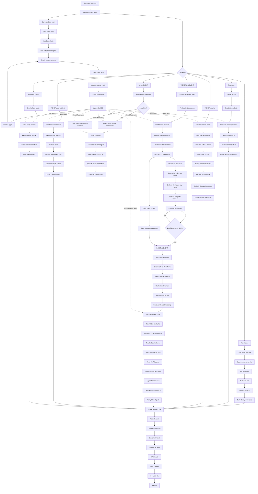

# DeepDiligence workflow structure

> **Pinned canonical map.** Every workflow/code change must update this file in
> the same change. If this map and another document conflict, stop and reconcile.

## Parallel workflow tree

## Always-active database branch

1. Scan `research_fact`, peers and internal modules.
2. Identify new, stale, missing and conflicting facts.
3. Search official/primary sources first.
4. Store every new or corrected fact immediately.
5. Preserve value, unit, population, dose, date and URL.
6. Separate reported, estimated, unavailable and conflict.
7. Never invent a missing value.
8. Rebuilds retain facts through `research_facts.json`.
9. Rescan after every upsert.
10. Keep scanning while research remains active.

The branch is mandatory in GPT, Gemini, Opus, TAM-indication, ClinicalTrials.gov
and model-judgement entrypoints; no research entrypoint may bypass it.

For every in-scope competitor, maximize these fields:

1. ORR.
2. CR.
3. PR.
4. mPFS/PFS.
5. mOS/OS.
6. DoR/EFS/DFS/RFS when reported.
7. Safety overview.
8. Named side effects.
9. Side-effect rates.
10. Dose/regimen.
11. Actual price.
12. Forecast price.

Unreported fields are stored as `unavailable` with a source and explanation.
Actual and forecast prices remain separate.

## Event screen gates

1. Trigger on `event EVENT` or `EVENT event`.
2. Resolve the exact official edition and dates.
3. Completed event: require disclosed quantitative human clinical data.
4. Future event: require an official announced quantitative clinical readout.
5. Reject attendance-only, trial-design, enrollment-only and preclinical items.
6. Require Nasdaq, NYSE or NYSE American listing at the cutoff.
7. Run the sub-USD-1B capital test in an isolated branch.
8. Pass only `capital_under_1000m` back to the clinical branch.
9. Never expose price, OHLC, return, reaction, volume, beta or targets.
10. Update the research database while the scan remains active.
11. Validate the price-blind evidence artifact.
12. Return only alphabetized ticker links; return `NONE` if empty.

## Test EVENT gates

1. Use completed clinical events only.
2. Use the earliest public disclosure date.
3. Keep the clinical interpretation price-blind.
4. Filter all commercial/price fields from clinical context.
5. Store commercial facts in the database when found elsewhere.
6. Lock clinical MS/LOA/Conv. before price calibration.
7. Fetch raw closes only in `[disclosure−7 days, disclosure)`.
8. Use completed sessions only.
9. Never use same-day/post-event data in the blind stage.
10. Scale target Base LOAs to the pre-event average close.
11. Keep every target breakdown visible.
12. Require `abs(sum(breakdown)/average−1) < 0.5%`.
13. Build Test formulas from the matching Test Scenarios module.
14. Fail on stale caches, strikes, broken references or duplicate IDs.

## Post-release scoring gates

1. Finish the blind workbook first.
2. Hash the clinical artifact and prediction fields.
3. Hash the original Test sheet below row 2.
4. Start a separate agent context.
5. Never feed post-release prices back to the blind agent.
6. Resolve the earliest public release timestamp.
7. Include release-day close only after a pre-close release.
8. Otherwise start with the next completed session.
9. Use exactly three eligible raw closes.
10. Fetch regular-session 60m raw High for those sessions.
11. Use no price or interpretation after the third close.
12. Score every active target from 1 to 10.
13. Treat 1 as miss and 10 as perfect.
14. Write closes in `D2:F2`.
15. Write each score in row 2 of its final-LOA column.
16. Find every exact highest-RJConv. scenario tie.
17. Test each blind price against the three-day peak.
18. Report USD/share and percent-of-peak difference.
19. Keep each review to one short sentence.
20. Append a separate audit trail below the blind evidence.
21. Store closes/highs under `price` and scores/tests under `backtest`.
22. Recheck the blind digest after saving.
23. Never revise locked LOA, MS, Conviction or breakdown.

## Catalyst/Test table invariants

1. Order: Scenario, Base Case, Final Market Price, Upside, RJConv.
2. Define RJConv. as Raw Joint Conviction.
3. Calculate RJConv. as the raw product of selected outcome convictions.
4. Keep Base RJConv. at 100%.
5. Sort scenario rows by RJConv. descending.
6. Put active outcome columns next.
7. Put active target groups next.
8. Put inactive target groups last.
9. Mask inactive groups grey; never hide them.
10. Keep inactive LOA and market share unchanged.
11. Use target Conviction as a >=10% filter and RJConv. input.
12. Never renormalize surviving RJConv. values.
13. Use every surviving outcome combination.
14. Sum all target Market Price columns.
15. Keep row/column anchors explicit.
16. Keep title-row index cells blank.
17. Calculate only rebuilt dependency ranges.

## Required synchronization

Any workflow modification must update, as applicable:

1. `00_WORKFLOW_STRUCTURE.md`.
2. `information/CATALYST_HISTORICAL_EVENTS_WORKFLOW.md`.
3. `information/PIPELINE_RESEARCH_REQUIREMENTS.md`.
4. The applicable skill `SKILL.md`.
5. Builders, validators and manifests.
6. Regression audits.
