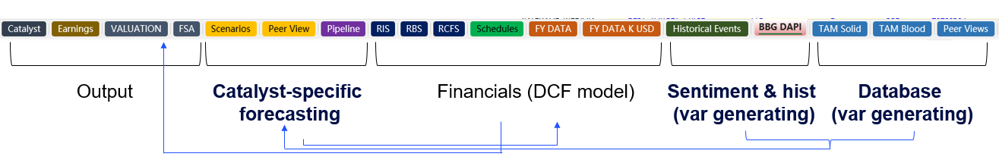

# AUTO_DCF

An automated biotech/pharmaceutical DCF (Discounted Cash Flow) valuation pipeline. Integrates SEC EDGAR financial data, ClinicalTrials.gov clinical trial metadata, Google Gemini Deep Research, and Anthropic Claude to produce investment-grade Excel models with per-drug revenue forecasting, scenario analysis, and catalyst tracking.

### Excel Tab Structure



The workbook is organised into five functional groups: **Output** sheets (Catalyst, Earnings, Valuation), **Catalyst-specific forecasting** (FSA, Scenarios, Peer View, Pipeline), **Financials / DCF model** (RIS, RBS, RCFS, Schedules, FY DATA, FY DATA K USD), **Sentiment & historical data** (Historical Events, BBG DAPI), and **Database / variable generation** (TAM Solid, TAM Blood, Peer Views).

## Architecture Overview

```
SEC EDGAR XBRL ──┐
                  ├─> core/sec_fetcher.py ──> main.py + core/excel_writer.py ──> FY DATA sheets
ClinicalTrials   │
.gov API v2 ─────┼─> research/clinical_trials_fetcher.py ──> trials.json
                  │                                               │
Yahoo Finance ───┤                                                ▼
News RSS ────────┼─> fill/fill_events.py ──────────────────> Historical Events sheet
Claude Haiku ────┘
                     fill/fill_tam.py ─────────────────────> TAM Solid / TAM Blood sheets
                     tam/expand_tam.py ────────────────────> TAM Solid (new drugs)

trials.json ─────┐
                  ├─> research/gemini_research.py ──> per-drug .md/.docx reports
Gemini Deep Res ──┘                                        │
                                                           ▼
                     generate/generate_scenarios.py ─────> Scenarios sheet
                     generate/generate_pipeline.py ──────> Pipeline sheet
                     fill/fill_peer_views.py ────────────> Peer Views sheet
                     generate/generate_financials.py ────> RBS / RCFS sheets
```

## Script-to-Sheet Mapping

| Script | Excel Sheet(s) | Purpose |
|--------|----------------|---------|
| `create_template.py` | FY DATA K USD, FY DATA, Historical Events | Generate blank formatted DCF template |
| `main.py` + `core/sec_fetcher.py` + `core/excel_writer.py` | FY DATA K USD, FY DATA | Fill financial statements (IS/BS/CFS) from SEC XBRL |
| `fill/fill_events.py` | Historical Events | Fill daily stock prices, news, AI-generated summaries |
| `fill/fill_tam.py` | TAM Solid+MM, TAM Blood | Fill drug revenue data (FY2024/2025 sales) |
| `tam/expand_tam.py` | TAM Solid+MM | Insert new drugs into TAM oncology section |
| `fill/fill_tam_forecast.py` | TAM Solid+MM, TAM Blood | Fill TAM forecast parameters and growth rates |
| `research/clinical_trials_fetcher.py` | *(JSON output)* | Fetch clinical trial data from ClinicalTrials.gov API |
| `research/gemini_research.py` | *(Markdown/Word output)* | Gemini Deep Research per-drug analysis reports |
| `generate/generate_scenarios.py` | Scenarios | Generate BASE/BULL/BEAR/CATALYST scenario sheets |
| `generate/generate_pipeline.py` | Pipeline | Fill Revenue Forecasting rows from research reports |
| `generate/generate_peer_views.py` | Peer Views | Style Peer Views sections with per-drug rating colors |
| `fill/fill_peer_views.py` | Peer Views | Parse research reports and fill drug readout data |
| `generate/generate_financials.py` | RBS, RCFS | Generate Restated Balance Sheet / Cash Flow sheets |
| `fix/fix_financials.py` | FY DATA K USD | Fix/adjust financial data post-fill |
| `fix/fix_tam_layout.py` | TAM Solid+MM | Fix TAM sheet layout and formatting |
| `fix/fix_tam_styles.py` | TAM Solid+MM | Fix TAM cell styles and conditional formatting |
| `fix/fix_tam_divzero.py` | TAM Solid+MM | Fix division-by-zero errors in TAM formulas |
| `tam/update_referred_tables.py` | Pipeline, Scenarios | Update cross-sheet formula references |
| `tam/update_revenue_formulas.py` | Pipeline | Update revenue calculation formulas |
| `tools/check_styles.py` | *(diagnostic)* | Inspect and validate Excel style indices |
| `tools/extract_pipeline.py` | *(diagnostic)* | Extract and inspect Pipeline sheet data |
| `tools/extract_peer_views.py` | *(diagnostic)* | Extract and inspect Peer Views data |
| `tools/notify.py` | *(email)* | Send email notification on completion |

## Excel Sheet Structure

The generated DCF workbook contains the following sheets:

| Sheet | Content |
|-------|---------|
| **FY DATA K USD** | Core financial data in thousands (IS, BS, CFS, ISN, BSN) |
| **FY DATA** | Summary in millions (SUMIFS referencing K USD sheet) |
| **Historical Events** | 4-year daily stock prices + news catalysts with AI summaries |
| **TAM Solid+MM** | Total Addressable Market for solid tumor oncology drugs |
| **TAM Blood** | Total Addressable Market for hematology drugs |
| **Pipeline** | Per-drug revenue forecasting (TAM x market share x pricing) |
| **Scenarios** | BASE/BULL/BEAR/CATALYST market share projections (2024-2038) |
| **Peer Views** | Drug-vs-drug clinical readout comparison tables |
| **RBS** | Restated Balance Sheet (auto-generated from FY DATA) |
| **RCFS** | Restated Cash Flow Statement (auto-generated from FY DATA) |

## Prerequisites

```bash
pip install -r requirements.txt
```

**Dependencies:** `openpyxl`, `requests`, `beautifulsoup4`, `lxml`, `yfinance`, `anthropic`, `python-dotenv`

**Additional (not in requirements.txt, install separately):**
```bash
pip install google-genai python-docx feedparser
```

**API Keys** (set as environment variables or in `.env`):

| Variable | Used By | Purpose |
|----------|---------|---------|
| `GEMINI_API_KEY` | `gemini_research.py` | Google Gemini Deep Research + Flash |
| `ANTHROPIC_API_KEY` | `fill_events.py` | Claude Haiku news summarisation |

## User Manual

### Quick Start: Full Workflow

```bash
cd ~/Investment/auto_dcf

# Step 1 — Create blank DCF template
python create_template.py --ticker BHVN

# Step 2 — Fill financial data from SEC EDGAR
python main.py --ticker BHVN --years 2020 2021 2022 2023 2024

# Step 3 — Fill Historical Events (stock prices + news)
python fill/fill_events.py BHVN

# Step 4 — Fill TAM drug data
python fill/fill_tam.py

# Step 5 — Fetch clinical trials
python research/clinical_trials_fetcher.py --ticker BHVN --company-name "Biohaven Ltd"

# Step 6 — Run Gemini Deep Research (per drug)
python research/gemini_research.py --ticker BHVN --company-name "Biohaven Ltd"

# Step 7 — Generate Scenarios sheet
python generate/generate_scenarios.py --ticker BHVN \
    --report-dir ~/Desktop/DD/BHVN/pipeline_base4/

# Step 8 — Fill Pipeline revenue forecasting
python generate/generate_pipeline.py --ticker BHVN --company-name "Biohaven Ltd"

# Step 9 — Fill Peer Views
python fill/fill_peer_views.py --ticker BHVN
```

### Step-by-Step Details

#### Step 1: Create Template

```bash
# Default (K USD mode, auto-detect FYE month)
python create_template.py --ticker BHVN

# MM USD mode (company reports in millions)
python create_template.py --ticker LNTH --unit MM

# Non-USD currency
python create_template.py --ticker MOLN --currency CHF

# Full options
python create_template.py --ticker BHVN --base-year 2020 \
    --he-years 2022 2023 2024 2025 --fye-month 12 --unit K
```

**Output:** `DD/{TICKER}/DCF {TICKER}.xlsx` with 2-3 formatted sheets (FY DATA K USD, FY DATA, Historical Events).

K USD mode generates 3 sheets; MM USD mode generates 2 (no K USD sheet needed).

#### Step 2: Fill Financial Data

```bash
python main.py --ticker BHVN --years 2020 2021 2022 2023 2024
python main.py --ticker CMPX --dry-run          # preview without writing
python main.py --ticker CMPX --unit MM           # force reporting unit
python main.py --ticker CMPX --cik 0001935979    # override CIK
```

Fetches XBRL data from SEC EDGAR and surgically patches FY DATA sheets. The `--dry-run` flag prints fetched data without modifying Excel.

**What gets filled:** Revenue, R&D, G&A, Operating Expenses, Net Income, EPS, Assets, Liabilities, Equity, Cash Flow, plus detailed notes (R&D components, PP&E breakdown, accrued liabilities).

**Validation:** 5 check rows verify data integrity (R&D notes = IS R&D, BS Assets = Liabilities + Equity, etc.). All should show 0.

#### Step 3: Fill Historical Events

```bash
python fill/fill_events.py BHVN
```

Fetches from 6 sources: Yahoo Finance prices, GlobeNewswire RSS, Google News RSS, SEC EDGAR 8-K filings, SEC EDGAR EFTS (conferences), and generates AI summaries via Claude Haiku (30 words for news, 65 words for moves >5%).

#### Step 4: Fill TAM Data

```bash
python fill/fill_tam.py                              # default template path
python fill/fill_tam.py --path /custom/path.xlsx     # custom path
```

Fills TAM Solid+MM and TAM Blood sheets with FY2024/2025 drug sales data. To add new drugs not in the template:

```bash
python tam/expand_tam.py --json-dir ./tam_data      # insert from JSON drug files
```

#### Step 5: Fetch Clinical Trials

```bash
python research/clinical_trials_fetcher.py --ticker CMPX \
    --company-name "Compass Therapeutics"
```

Extracts NCT numbers from 10-K/8-K SEC filings, queries ClinicalTrials.gov API v2, and outputs a JSON file with trial metadata (phase, status, conditions, interventions, dates).

#### Step 6: Gemini Deep Research

```bash
# Auto-detect all pipeline drugs
python research/gemini_research.py --ticker CMPX \
    --company-name "Compass Therapeutics"

# Research specific drugs
python research/gemini_research.py --ticker CMPX \
    --company-name "Compass Therapeutics" --drugs CTX-009 CTX-8371

# Use existing trials JSON
python research/gemini_research.py --ticker CMPX \
    --company-name "Compass Therapeutics" \
    --trials-json path/to/trials.json
```

Uses Gemini Deep Research Agent for autonomous multi-step web research. Generates per-drug reports covering TAM, competitive landscape, clinical data, market share forecasts (BASE/BULL/BEAR), and catalyst events.

**Output:** Markdown (.md) + Word (.docx) reports in `DD/{TICKER}/pipeline_base4/`.

#### Step 7: Generate Scenarios

```bash
# Base case only
python generate/generate_scenarios.py --ticker CMPX \
    --report-dir path/to/pipeline_base4/

# Full (base + bull + bear)
python generate/generate_scenarios.py --ticker CMPX \
    --report-dir path/to/pipeline_base4/ \
    --bull-dir path/to/pipeline_bull2/ \
    --bear-dir path/to/pipeline_bear3/
```

Parses research reports, extracts market share forecasts and stage timelines, applies maturity curves (BIC/T1/AVG), and fills the Scenarios sheet with:

| Module | Content |
|--------|---------|
| Absolute Value (Scenario 4) | All drugs, complete data |
| Base/Bull/Bear (Scenario 1-3) | Different peak market share assumptions |
| Break Down (Scenario 5+) | Per-drug cumulative build-up |
| Catalyst (Scenario 9+) | Positive/negative catalyst scenarios |

#### Step 8-9: Pipeline & Peer Views

```bash
python generate/generate_pipeline.py --ticker CMPX \
    --company-name "Compass Therapeutics"

python fill/fill_peer_views.py --ticker CMPX
```

Pipeline: fills revenue forecasting rows (TAM x market share x pricing) per drug per indication.

Peer Views: parses Gemini reports for drug readout comparison tables and fills the Peer Views sheet with color-coded BIC/T1/AVG ratings.

### Key Design Decision: Non-Destructive Excel Patching

All scripts use `zipfile` + `xml.etree.ElementTree` for surgical cell-level XML patching instead of `openpyxl.save()`. This preserves VBA macros, styles, shared strings, formula chains, and conditional formatting that would be destroyed by a standard save. A timestamped backup is created automatically before each write.

### File Paths

| Purpose | Default Path |
|---------|-------------|
| Excel files | `C:\Users\yzsun\Desktop\DD\{TICKER}\DCF {TICKER}.xlsx` |
| Research reports | `DD/{TICKER}/pipeline_base4/`, `pipeline_bull2/`, `pipeline_bear3/`, `pipeline_catalyst/` |
| Clinical trials | `DD/{TICKER}/{TICKER}_clinical_trials_*.json` |
| Backups | `DCF {TICKER}_backup_{timestamp}.xlsx` (same directory) |

All scripts accept `--path` to override the default Excel path.

### Troubleshooting

| Issue | Solution |
|-------|----------|
| `FileNotFoundError` for Excel | Use `--path` to specify correct file location |
| Check rows showing non-zero | Re-run `main.py` to refresh; investigate mismatched note details |
| Gemini API timeout | Script auto-retries with polling fallback; re-run if needed |
| `Removed Records` warning in Excel | Run `fix/fix_financials.py --ticker TICKER` to normalize XML |

## Project Structure

```
auto_dcf/
  main.py                        # CLI entry point — fill FY DATA from SEC EDGAR
  create_template.py             # Generate blank DCF Excel template
  requirements.txt               # Python dependencies
  │
  core/                          # Shared library modules
    sec_fetcher.py               #   SEC EDGAR XBRL data extraction
    excel_writer.py              #   Surgical Excel XML patching engine
    tam_solid_cells.py           #   TAM Solid cell data definitions
  │
  research/                      # AI research & data collection
    gemini_research.py           #   Gemini Deep Research per-drug reports
    clinical_trials_fetcher.py   #   ClinicalTrials.gov API integration
    research_tam_indications.py  #   TAM indication research via Gemini
  │
  generate/                      # Sheet content generation
    generate_scenarios.py        #   Scenarios sheet (BASE/BULL/BEAR/CATALYST)
    generate_pipeline.py         #   Pipeline Revenue Forecasting
    generate_peer_views.py       #   Peer Views styling & color ratings
    generate_financials.py       #   RBS / RCFS sheet generation
  │
  fill/                          # Data filling operations
    fill_events.py               #   Historical Events (prices + news + AI)
    fill_tam.py                  #   TAM drug revenue data (FY2024/2025)
    fill_tam_forecast.py         #   TAM forecast parameters & growth rates
    fill_peer_views.py           #   Peer Views data from Gemini reports
  │
  fix/                           # Post-fill corrections
    fix_financials.py            #   Financial data fixes (RIS/Schedules)
    fix_tam_layout.py            #   TAM sheet layout & row fixes
    fix_tam_styles.py            #   TAM cell style & formatting fixes
    fix_tam_divzero.py           #   TAM formula #DIV/0! fixes
    fix_tam_divzero2.py          #   TAM formula fixes (additional rows)
  │
  tam/                           # TAM expansion & reference sync
    expand_tam.py                #   Insert new drugs into TAM
    reorganize_tam.py            #   Reorganise TAM multi-indication drugs
    update_referred_tables.py    #   Sync Pipeline/Scenarios from TAM
    update_revenue_formulas.py   #   Rewrite Pipeline revenue formulas
  │
  tools/                         # Utilities & diagnostics
    notify.py                    #   Email notification
    check_styles.py              #   Excel style inspector
    extract_pipeline.py          #   Pipeline data extraction
    extract_peer_views.py        #   Peer Views extraction
    extract_peer_views_2.py      #   Peer Views extraction v2
    extract_peer_views_3.py      #   Peer Views extraction v3
  │
  information/                   # Documentation & specs
  draft/                         # Development drafts & prototypes
```

## Datasets (Not Included)

TAM drug revenue datasets (`tam_data/`, `tam_hl_mm_data/`, `tam_*_research.json`) are excluded from this repository. These contain proprietary drug sales and market research data required by `fill_tam.py` and `expand_tam.py`.
