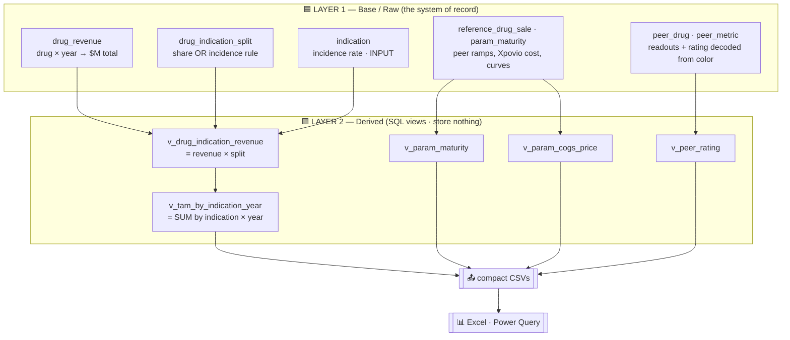

# 🗄️ The DD Data Center — why it's built this way

> **TL;DR** — The due-diligence reference data (TAM Solid / TAM Blood / Peer
> Views) is moved out of Excel into a small, scalable **DuckDB + Parquet** store.
> Raw facts live in **Layer 1**; TAM and model parameters are **Layer 2 views**
> that *reference* Layer 1. A thin Python build recomputes everything and
> publishes **compact CSVs** that Excel reads through native **Power Query**.
> Result: lighter, faster, scalable, key-addressed, and fully scriptable.

---

## 1. Why move the data out of Excel? 🤔

The reference tabs had grown into a ~560-row **web of live, interdependent
formulas**, and that created three compounding problems:

| 🚩 Problem | What it looked like |
|---|---|
| **Recalc lag & file bloat** | Cells like `=T9/3/(T468/T470)` recompute on every edit. Hundreds of them ⇒ a heavy, slow workbook. |
| **Hard-coded row numbers** | TAM was `=SUMIF($D$9:$D$562,$D406,P$9:P$562)`. Adding **one** drug shifted hundreds of rows and forced manual edits across four scripts (`GROWTH_ROW={551,552,553}`, `COGS_PRICE_ROW=562`, …). The last expansion shifted everything **+61 rows**. |
| **Fragile XML patching** | Writing cells via raw `.xlsx` zip surgery breaks the moment Excel re-saves and renumbers style indices. |

The raw data was *already* half-out of Excel (per-drug `*.json` files), so the
fix is to finish the job: **let code own the data and the math; let Excel just
read the answers.**

---

## 2. What you asked for → how each requirement is met 🎯

| Your requirement | How the Data Center delivers it |
|---|---|
| 🪶 **Low memory / no lag** | Excel stops storing a formula web — it reads **values** by key, which recalc instantly. The whole store is one ~4 MB file; the published CSVs are tens of KB. |
| 🔗 **Easy for Excel to reference** | Native **Power Query** loads CSVs into refreshable Tables — **zero install** (no ODBC driver, no add-in). Downstream tabs use `XLOOKUP` / `SUMIFS` on keys. |
| 🔄 **Easy to auto-update & manage** | A new DD finding → edit one JSON (or `INSERT` a row) → `python build_datastore.py`. Idempotent, one command. SQL constraints + Parquet partitions keep it clean as it grows. |
| 🤖 **Fully code-controllable** | Pure Python + SQL, embedded DuckDB (`pip install duckdb`), no server, no GUI step in the core loop. An AI agent can run the whole pipeline headless. |

---

## 3. The two-layer database — the heart of the design 🧱

The store is split exactly along the **raw vs. computed** line. This is the
"two layers" idea: a base layer of facts, and a derived layer that *references*
the base layer to produce TAM and parameters.



### 🟦 Layer 1 — only raw facts (you / the agent edit these)

| Table | Holds |
|---|---|
| `drug` | name, company, molecule, `tam_group` (solid / blood) |
| `drug_revenue` | a drug's **total** net sales per year ($M) — the real-world fact |
| `drug_indication_split` | how that revenue splits across indications (`share` or incidence-weighted) — the **assumption**, kept apart from the fact |
| `indication` | incidence **rate** (epidemiology **input**, not derived) |
| `reference_drug_sale` · `param_maturity` | peer ramps + Xpovio cost lines + the maturity curve used to *derive* parameters |
| `peer_drug` · `peer_metric` | Peer Views readouts + **BIC/T1/AVG rating decoded from cell fill color → text** |

### 🟩 Layer 2 — everything computed, as views referencing Layer 1

| View | Replaces the old sheet formula |
|---|---|
| `v_drug_indication_revenue` | the per-drug `=K359*0.339` breakdown rows |
| `v_tam_by_indication_year` | `=SUMIF($D$9:$D$562, …)` — now a `GROUP BY` |
| `v_param_maturity` (AVG/BIC/T1 × year-offset) | the maturity-curve rows (R551–R553) |
| `v_param_cogs_price` | the Xpovio COGS chain (R556–R562) |
| `v_peer_rating` | the color-coded rating, now an explicit text lookup |

> 🔑 **A subtle but important split:** the sheet's *"Parameters"* section mixes
> **inputs** (incidence, list price, population) with **derived** values
> (maturity, COGS/Price). We split by *role*, not by which section a row sat in —
> inputs go to Layer 1, computed values become Layer 2 views.

### 🛡️ Why two layers kills the old pain

- **No row numbers.** Facts are keyed by `(drug_id, indication_code, year)`.
  Adding a drug is an `INSERT`; nothing shifts, no constant to bump.
- **No stale derived data.** Layer 2 are *views* — always consistent with
  Layer 1, recomputed on read.
- **Integrity for free.** Foreign keys reject a typo'd indication or an orphan
  split before it can corrupt a TAM number.
- **Color stops being data.** The Peer Views rating moves from a fill color into
  a real text column you can query.

---

## 4. Why DuckDB + Parquet + CSV/Power Query 📈

Small today, expected to grow a lot — so the engine has to scale smoothly:

- **Columnar & vectorized** — the TAM rollup (`SUM … GROUP BY indication, year`)
  is exactly its strength; scales from thousands to **billions of rows** on one
  machine, even larger-than-RAM.
- **Parquet-native** — durable, compressed, **partitionable by year / domain**;
  DuckDB queries the Parquet lake directly. That's the big-data-management layer.
- **Embedded** — one `pip install`, a single file, no server to run or secure.
- **Clean growth path** — if it ever truly explodes, the same SQL lifts to
  **MotherDuck** (cloud DuckDB) with no model rewrite.

> 💡 **Why not connect Excel straight to the database?** Every live-DB path on
> Windows needs a non-native driver (SQLite/DuckDB → third-party ODBC; Postgres →
> Npgsql in the GAC), which breaks the headless / zero-install goal. Excel has
> **no** native connector for SQLite, DuckDB, or Parquet — but it *does* have
> native Power Query for **CSV**. So we compute in DuckDB and hand Excel a CSV.

---

## 5. The update loop 🔁


⚠️ **Excel-at-scale:** a worksheet caps at 1,048,576 rows, so the raw millions
(when they come) **never enter Excel**. DuckDB aggregates down to the compact
grain the analyst needs (TAM by indication × year is a few hundred rows) and only
that is published; for anything huge, Power Query loads to the Data Model.

---

## 6. What's in the store today 📦

All three "data center" tabs are ingested:

- **TAM Solid** — full solid-tumor drug market + indication splits.
- **TAM Blood** — CAR-T / BTKi / Heme-Other segments + HL / MM blocks.
- **Peer Views** — drug-vs-drug readouts with the rating **decoded to text**.

≈ **139 drugs · 29 indications · 2,449 revenue rows · 19 peer sections** in a
~4 MB DuckDB file; 11 compact CSVs published for Power Query. The store is
non-destructive — the live workbook is untouched. (`PHASE2_MIGRATION.md` maps how
the downstream Pipeline formulas move onto these tables.)

### Run it

```bash
pip install duckdb openpyxl                       # one-time
python datastore/extract_tam_solid.py            # sheet parameters → seed
python datastore/extract_legacy_drugs.py         # legacy solid drugs → seed
python datastore/extract_tam_blood.py            # TAM Blood roster → seed
python datastore/extract_peer_views.py           # Peer Views (color→text) → seed
python datastore/build_datastore.py              # build DB + publish CSVs
python datastore/validate_vs_sheet.py            # fidelity check vs the live sheet
```

See **`POWER_QUERY_SETUP.md`** for wiring Excel to the published folder.
