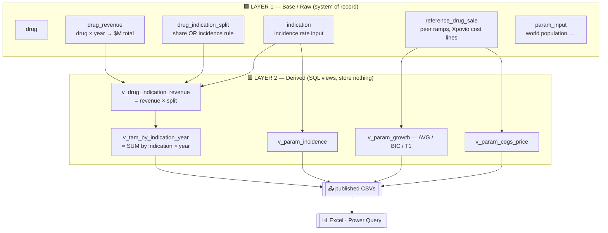

# 🗄️ The DD Data Center — a two-layer database behind Excel

> **TL;DR** — The due-diligence reference data (TAM Solid / TAM Blood / Peer
> Views) moves out of Excel into a small, scalable **DuckDB + Parquet** store.
> A thin Python build recomputes everything and publishes **compact CSVs** that
> Excel reads through native **Power Query**. Raw facts live in **Layer 1**;
> TAM and model parameters are **Layer 2 views** that reference Layer 1. The
> result is lighter, faster, scalable, and fully scriptable.

---

## 1. Why move the data out of Excel? 🤔

The `TAM Solid` tab grew into a ~560-row **web of live, interdependent
formulas** — and that created three compounding problems:

| 🚩 Problem | What it looked like |
|---|---|
| **Recalculation lag & bloat** | Cells like `=T9/3/(T468/T470)` and `=T$33*(T$463/(T$463+T$464+T$465))` recompute on every edit. Hundreds of them ⇒ a heavy, slow workbook. |
| **Hard-coded row numbers** | TAM was `=SUMIF($D$9:$D$399,$D406,P$9:P$399)`. Adding **one** drug shifted hundreds of rows and forced manual edits across four scripts (`GROWTH_ROW={551,552,553}`, `COGS_PRICE_ROW=562`, …). The last expansion shifted everything by **+61 rows**. |
| **Fragile XML patching** | Writing cells via raw `.xlsx` zip surgery breaks the moment Excel re-saves and renumbers style indices. |

The data was *already* half-out of Excel (per-drug `*.json` files), so the fix
is to finish the job: **let code own the data and the math; let Excel just read
the answers.**

---

## 2. Design goals → how each is met 🎯

| Goal | How the Data Center delivers it |
|---|---|
| 🪶 **Minimal memory / no lag** | Excel stops storing a formula web. It reads **values** by key, which recalc instantly. The whole store is a single ~4 MB file; published CSVs are tens of KB. |
| 🔗 **Easy for Excel to reference** | Native **Power Query** loads CSVs into refreshable Tables — **zero install** (no ODBC driver, no add-in). Downstream tabs use `XLOOKUP`/`SUMIFS` on keys. |
| 🔄 **Easy to auto-update & manage** | New DD finding → edit one JSON → `python build_datastore.py`. Idempotent, one command. Parquet partitions + SQL constraints keep it clean as it grows. |
| 🤖 **Fully code-controllable** | Pure Python + SQL, embedded DuckDB (`pip install duckdb`), no server, no GUI step in the core loop. An AI agent can run the whole pipeline headless. |

---

## 3. Why DuckDB + Parquet (built for growth) 📈

Today the data is small; it is expected to grow a lot. DuckDB is the sweet spot:

- **Columnar & vectorized** — the TAM rollup (`SUM … GROUP BY indication, year`)
  is exactly what it's fastest at; scales from thousands to **billions of rows**
  on one machine, even larger-than-RAM.
- **Parquet-native** — durable, compressed, **partitionable by year/domain**;
  DuckDB queries the Parquet lake directly. That's the "big-data management" layer.
- **Embedded** — one `pip install`, a single file, no server to run or secure.
- **Clean growth path** — if it ever truly explodes, the same SQL lifts to
  **MotherDuck** (cloud DuckDB) with no model rewrite.

> 💡 **Why not connect Excel straight to the database?** Because every live-DB
> path on Windows needs a non-native driver (SQLite/DuckDB → third-party ODBC;
> Postgres → Npgsql in the GAC) — which breaks the "headless / zero-install"
> goal. Excel has **no** native connector for SQLite, DuckDB, or Parquet; it
> *does* have native Power Query for **CSV**. So we compute in DuckDB and hand
> Excel a CSV.

---

## 4. The two layers 🧱

The database is split exactly along the **raw vs. computed** line.



### 🟦 Layer 1 — only raw facts (you / the agent edit these)

| Table | Holds |
|---|---|
| `drug` | name, company, molecule, `tam_group` (solid/blood) |
| `drug_revenue` | a drug's **total** net sales per year ($M) — the real-world fact |
| `drug_indication_split` | how that revenue splits across indications (`share` or incidence-weighted) — the **assumption**, kept separate from the fact |
| `indication` | incidence **rate** (epidemiology **input**, not derived) |
| `reference_drug_sale` | peer ramps (Alimta, Tagrisso, …) + Xpovio cost lines used to *derive* parameters |
| `param_input` | scalar globals (world population, growth rate) |

### 🟩 Layer 2 — everything computed, as views referencing Layer 1

| View | Replaces the old sheet formula |
|---|---|
| `v_drug_indication_revenue` | the per-drug `=K359*0.339` breakdown rows |
| `v_tam_by_indication_year` | `=SUMIF($D$9:$D$399, …)` — now a `GROUP BY` |
| `v_param_growth` (AVG/BIC/T1) | the maturity/growth rows (R551–R553) |
| `v_param_cogs_price` | the Xpovio COGS chain (R556–R562) |
| `v_param_incidence` | the incidence parameter rows |

> 🔑 **One important refinement:** the sheet's *"Parameters"* section mixes
> **inputs** (incidence, list price, population) with **derived** values
> (growth, maturity, COGS/Price). We split by *role*, not by which section a row
> sat in — inputs go to Layer 1, computed values become Layer 2 views.

### 🛡️ Why two layers kills the old pain

- **No row numbers.** Facts are keyed by `(drug_id, indication_code, year)`.
  Adding a drug is an `INSERT`; nothing shifts, no constant to bump.
- **No stale derived data.** Layer 2 are *views* — always consistent with
  Layer 1, recomputed on read.
- **Integrity for free.** Foreign keys reject a typo'd indication or an orphan
  split before it can corrupt a TAM number.

---

## 5. The update loop 🔁


The raw millions (when they come) **never enter Excel** — Excel's hard limit is
1,048,576 rows. DuckDB aggregates down to the compact grain the analyst needs
(TAM by indication × year is a few hundred rows) and only that is published.

---

## 6. Footprint & status 📦

- **Store:** one DuckDB file (~4 MB, mostly fixed overhead) + a Parquet lake.
- **Published to Excel:** all CSVs together ≈ tens of KB today.
- **Phase 1 — done:** schema (Layer 1 + Layer 2), ingest from per-drug JSON,
  parameters seeded from the live `TAM Solid` sheet, CSV publishing + Power Query
  guide. **Non-destructive — the live workbook is untouched.**
- **Phase 1b — done:** backfilled the full legacy solid-tumor drug market
  (R9–R341) straight from the live sheet via `extract_legacy_drugs.py`.
- **Phase 1c — done:** backfilled the **TAM Blood** roster via
  `extract_tam_blood.py`. TAM Blood is mechanism-grouped (CAR-T, BTKi,
  Heme-Other) plus red-font HL / MM blocks; we capture each drug's net sales
  tagged with its segment. Layer 1 now holds **~139 drugs (101 solid / 38 blood)
  across 29 indications/segments**. *(The sheet's list-price market-sizing — the
  UPPERCASE "purchases" rows — is Layer-2 math deferred to a later pass.)*
- **Cross-indication TAM policy:** **include** an IO drug's minor indication
  slices (the more-complete definition) — this is the datastore's default.
- **Next:** refine the maturity-curve / growth parameters and the blood
  list-price market-sizing, then repoint the downstream tabs from row-based
  formulas to key-based lookups on a workbook **copy**.

### 🎯 Fidelity check (`validate_vs_sheet.py`)

The datastore's TAM is compared to the sheet's own SUMIF TAM rows:

| Indication | vs sheet | Why |
|---|---|---|
| **NSCLC, HNSCC** | within ~±13% (near-exact 2023) | dominated by drugs captured in full |
| **BTC, Melanoma** | datastore **higher** | it now *comprehensively* adds Keytruda/Opdivo minor slices (e.g. 9% melanoma × $29.5 B) that the sheet's TAM rows don't sum |
| **CRC** | datastore ~25% lower | a few contributors carry uncached / residual-formula splits |

> 🧭 **A real modeling decision surfaces here:** should an immuno-oncology giant's
> *small* share of an indication count toward that indication's TAM? The
> datastore says yes (more complete); the legacy sheet said no. This is now an
> explicit, one-line policy choice instead of a side effect of which cells Excel
> happened to cache.

---

### Run it

```bash
pip install duckdb openpyxl                       # one-time
python datastore/extract_tam_solid.py            # harvest sheet parameters → seed
python datastore/extract_legacy_drugs.py         # backfill legacy solid drugs → seed
python datastore/extract_tam_blood.py            # backfill TAM Blood roster → seed
python datastore/build_datastore.py              # build DB + publish CSVs
python datastore/validate_vs_sheet.py            # fidelity check vs the live sheet
```

See **`POWER_QUERY_SETUP.md`** for wiring Excel to the published folder.
